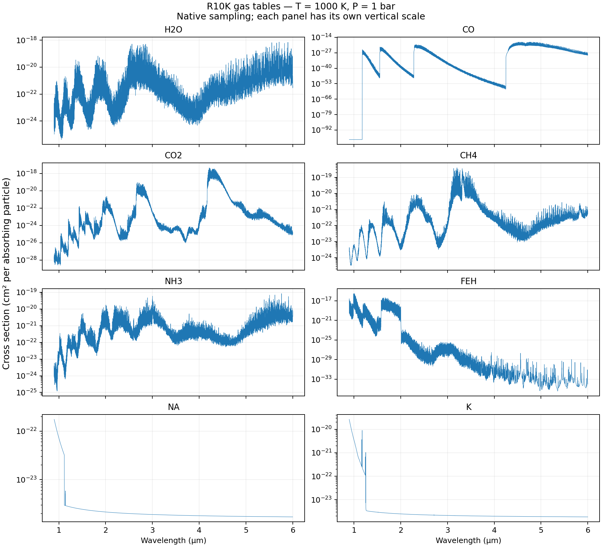
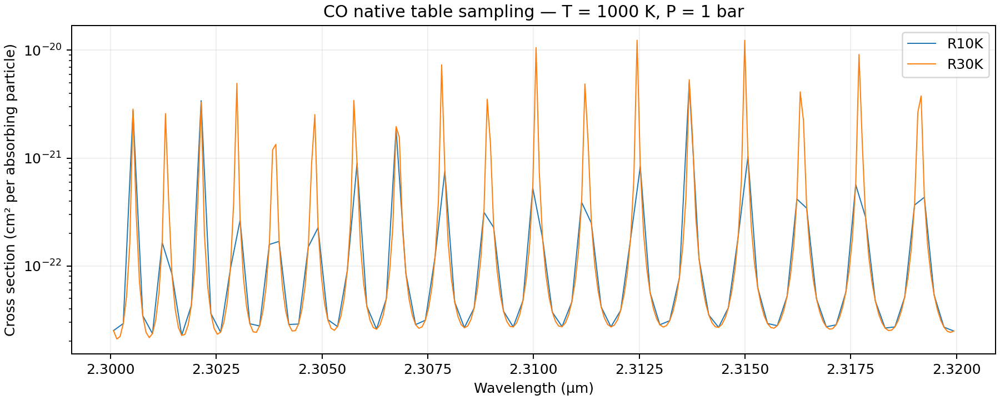

Gas opacity tables
==================

Gas abundances describe how much of each species is present; opacity tables
supply its absorption cross section as a function of pressure, temperature,
and wavelength. Brewster combines these cross sections with the abundances
and layer column densities to calculate optical depth. A cross-section plot
is useful for locating absorption bands, but it is not a model spectrum and
does not by itself show which gas dominates a retrieved atmosphere.

Selecting the gas tables
------------------------

Three settings have different roles:

``gaslist``
   The species included in the model, for example ``["h2o", "co", "ch4"]``.

``ModelConfig.xlist``
   A text manifest mapping gas names to opacity filenames, for example
   ``data/gaslistR10K.dat`` or ``data/gaslistR30K.dat``.

``ModelConfig.xpath``
   The directory containing the actual opacity tables. The manifest is not
   the opacity dataset; download the matching files separately.

Each manifest row has four whitespace-separated fields:

.. code-block:: text

   1   h2o   18.01528   h2o_ucl2017_xsecs_R10K.pic

These are the gas identifier, gas name, molecular/atomic mass field, and
opacity filename. Keep identifiers and metadata consistent with the supplied
list rather than renumbering rows. Gas names are matched without regard to
case, but filenames must match the files on disk, including their case on
case-sensitive systems. A filename of ``nn`` is a placeholder, not an available
table: do not select that species without supplying a valid opacity file.

For an existing model configuration, set the paths before constructing
``ArgsGen`` or starting the retrieval:

.. code-block:: python

   model_config_instance.xlist = "./data/gaslistR10K.dat"
   model_config_instance.xpath = "../Linelists/"
   model_config_instance.update_dictionary()

These relative paths assume execution from the Brewster repository root.
Keep the trailing slash on ``xpath``: the current loader concatenates it
with the manifest filename. To select the R30K set, change ``xlist`` to
``./data/gaslistR30K.dat`` and provide its matching opacity files.

R10K and R30K
-------------

The names describe the nominal spectral sampling of the cross-section tables,
with resolving-power notation :math:`R = \lambda/\Delta\lambda` (equivalently
:math:`\tilde\nu/\Delta\tilde\nu` for closely spaced wavenumber samples).
They do not specify the resolving power of the observations.

.. list-table::
   :header-rows: 1
   :widths: 25 15 60

   * - Manifest
     - Nominal sampling
     - Notes on the current file
   * - ``gaslistR10K.dat``
     - 10,000
     - Selects ``h2o_ucl2017_xsecs_R10K.pic`` for water and
       ``12C1H4_xsecs_R10K.pic`` for methane. Some species have ``nn`` entries.
   * - ``gaslistR30K.dat``
     - 30,000
     - Selects ``h2o_UCL2017_xsecs_R30K.pic`` for water and
       ``ch4_hitemp_xsecs_R30K.pic`` for methane; it also lists additional
       species and isotopologues.

R30K uses approximately three times as many spectral samples over the same
wavelength interval, increasing the size of the loaded opacity array and the
work done across wavelength. Finer sampling does not guarantee a better fit.
Check the final, instrument-processed model for sensitivity to the chosen
tables while keeping the atmosphere and observational processing fixed.

Switching these manifests is not necessarily a pure resolution test: the
selected line-data files can also differ, as the methane filenames demonstrate.
Check the dataset provenance and broadening prescriptions before attributing
a difference solely to sampling. Do not rename a table to make it R30K; the
actual wavelength grid determines its sampling.

The separate instrument ``R_file`` or ``fwhm`` controls how the emergent model
spectrum is processed for comparison with observations in ``specops.proc_spec``.
It does not change the sampling of the input opacity tables. Conversely,
choosing ``gaslistR30K.dat`` does not make the observed spectrum R=30,000.

.. note::

   ``gaslistR10K_old.dat`` and ``gaslistRox.dat`` are separate manifests, not
   aliases for ``gaslistR10K.dat``. For reproducibility, record the exact
   manifest, opacity filenames, and alkali option used by a run. The
   ``malk`` setting can substitute K and Na filenames: 0 leaves the selected
   filenames unchanged, 1 selects ``K_Mike_``/``Na_Mike_`` substitutions,
   and 2 selects ``K_2021_``/``Na_2021_`` substitutions. The plotting notebook
   below reads the manifest directly and therefore represents ``malk=0``.

Table layout and units
----------------------

The pickle tables used in this example contain:

.. code-block:: python

   wavenumber, table_pressure, table_temperature, cross_section = pickle.load(handle)

* ``wavenumber``: spectral coordinates in cm\ :sup:`-1`.
* ``table_pressure``: pressure grid in bar.
* ``table_temperature``: temperature grid in K.
* ``cross_section``: linear cross sections in cm\ :sup:`2` per absorbing
  particle, with axes ``(pressure, temperature, wavenumber)``. For molecular
  species this is cm\ :sup:`2`/molecule; Na and K are atomic species.

Convert to wavelength in micrometres using ``wavelength = 1e4 / wavenumber``.
Increasing wavenumber gives decreasing wavelength; reverse both coordinates
and cross sections when plotting with increasing wavelength.

The pickle branch of ``utils.get_opacities`` interpolates log cross sections
in log pressure and returns an array ordered as
``(gas, model_pressure, table_temperature, wavelength)``. The Fortran
line-opacity routine then interpolates in log temperature. Within a layer,
the cross section is multiplied by the species VMR and total column density;
the code converts cm\ :sup:`2` to m\ :sup:`2` when combining it with the
column density expressed in SI units.

Use each table's actual pressure, temperature, and wavelength limits. The
plotting example rejects requests outside those limits and checks for invalid
cross sections. It does not replace invalid values with an arbitrary floor.
This example covers the legacy pickle tables only; do not apply its linear
cross-section interpretation to HDF5 datasets named ``log(sigma)`` without
checking their units and format.

Plot the gas cross sections
---------------------------

The following plots use **T = 1000 K and P = 1 bar** as an illustrative
comparison, not as a retrieved atmospheric state. Each gas is shown without
abundance weighting, instrumental convolution, or display rebinning.

   R10K cross sections from the filenames selected by ``gaslistR10K.dat``.
   Each panel has its own vertical scale. Relative band strengths in these
   plots should not be interpreted as relative contributions to a spectrum. Very small cross sections and flat
   tails are retained from the supplied tables; they should not be treated
   as independently established physical continua.

   A narrow CO interval showing the native sampling of the two tables.
   Both curves are evaluated at the same pressure and temperature. This is
   a comparison of the supplied files, not proof of identical line-data
   provenance or a comparison of convolved emergent spectra.

.. toctree::
   :hidden:

   ../tutorials/Brewster_v2_Gas_Opacity

Read the :doc:`worked notebook <../tutorials/Brewster_v2_Gas_Opacity>` online,
or download the :download:`gas opacity plotting notebook
<../tutorials/Brewster_v2_Gas_Opacity.ipynb>` to reproduce or modify the plots.
Set ``project_root`` to your Brewster checkout and ``opacity_directory`` to
your downloaded Linelists folder. The default relative path assumes the
notebook kernel starts in ``docs/source/tutorials/``. The notebook requires
NumPy, SciPy, Matplotlib, and Jupyter; it reads the tables directly without
running the forward model.

The example interpolates log cross section at the requested log pressure and
log temperature instead of selecting an index from a different pressure grid.
After interpolating a table onto a new grid, any subsequent indexing must use
that new grid. Reusing the original grid's index can silently plot a different
pressure. Only load pickle files from a trusted source.

Other opacity sources
---------------------

The gas-list plots show individual line cross sections, not all opacity in
the forward model. Collision-induced absorption uses separate CIA tables;
H-minus bound-free/free-free and H2-minus free-free contributions are handled
by the BFF calculation controlled by ``do_bff``. Rayleigh scattering and
:doc:`clouds` also have separate calculations. The chemistry and vertical
abundance choices are described in :doc:`gases`.
